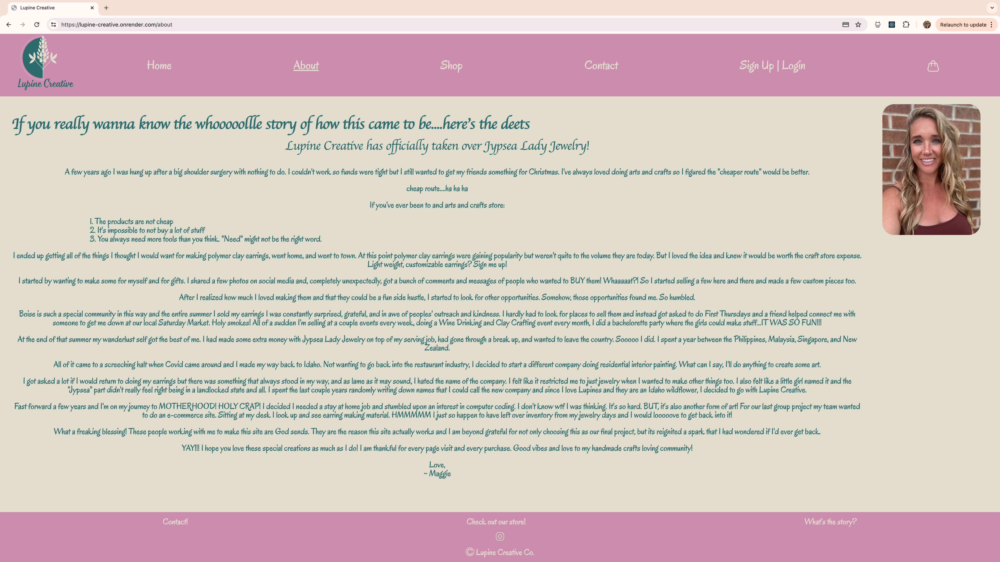
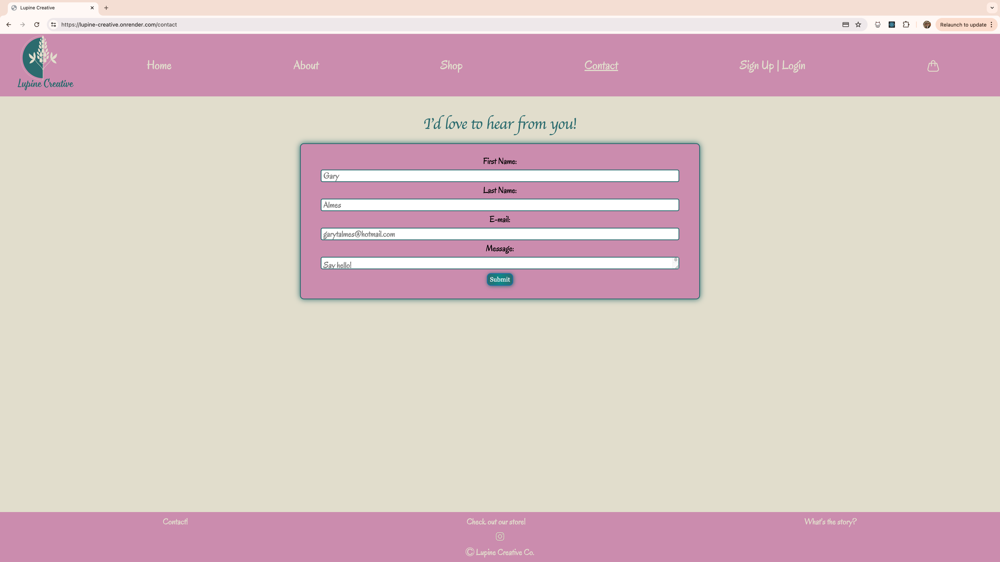
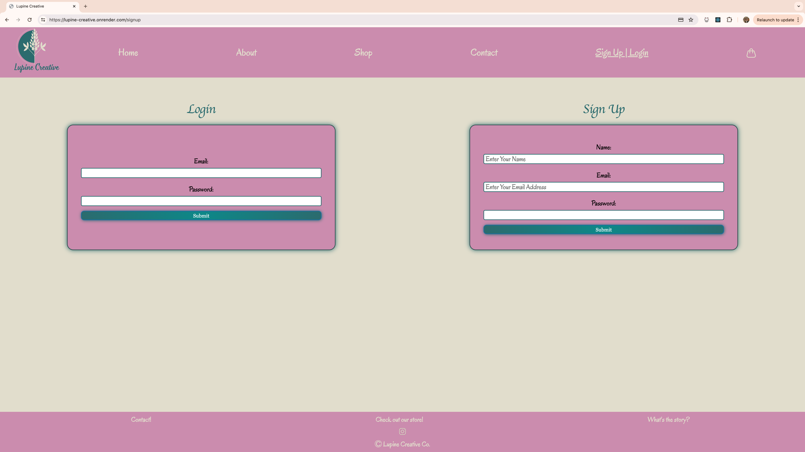
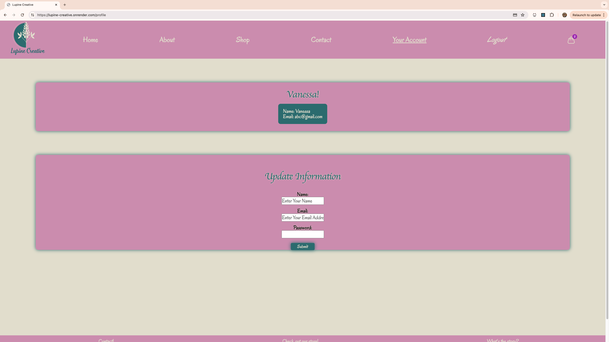
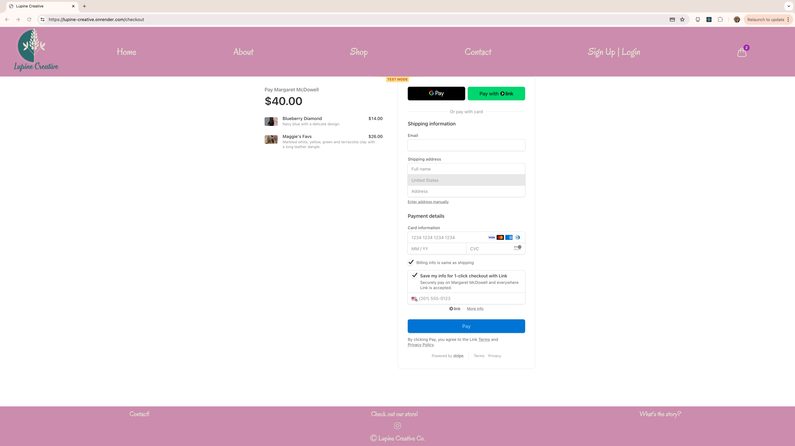

# Lupine Creative

## Overview Description
Welcome to Lupine Creative!

Lupine Creative emerged from a stint of creativity during recovery from a shoulder surgery, blossoming from a desire to create affordable gifts. 

Initially I was crafting polymer clay earrings for personal enjoyment, the unexpected demand led to a flourishing side hustle. 

Now, Lupine Creative thrives as a platform for unique handmade creations, fueled by the support of a vibrant community.

## Table of Contents

* [Description](#overview-description)

* [Authors](#authors)

* [Badges and Acknowledgements](#badges-and-acknowledgements)

* [Screenshot](#screenshot)

* [Questions](#questions)

## Authors

* [Andrew Bollard](https://github.com/4Bollard)
* [Vanessa Bou](https://github.com/rvbouu)
* [Brittany Jungclaus](https://github.com/NovaLanceBrittany)
* [Maggie McDowell](https://github.com/magtron3030)
* [Joel Simonson](https://github.com/J5imonson)

## Badges and Acknowledgements

***Thank you*** to our instructor Gary and TAs, Austin and Katy, for assisting us with our many GitHub and code issues.

***Thank you*** to all team members for all their hard work and efforts.

## Screenshots

#### Home Page

#### About Page

#### Shop Page

#### Contact Page

#### Login/Signup page

#### Profile Page

#### Checkout Page

#### The Presentation
[Click Here](https://docs.google.com/presentation/d/1yqcji5gK83xaxhkvDqH_Qg-viYdJX41neZAuBBxvQQ8/edit?usp=sharing) 

## Deployed Application:
[Click Here](https://github.com/rvbouu/lupine_creative) to view the Repository for this project.

[Click Here](https://lupine-creative.onrender.com/) to view the deployed version of the web application. 